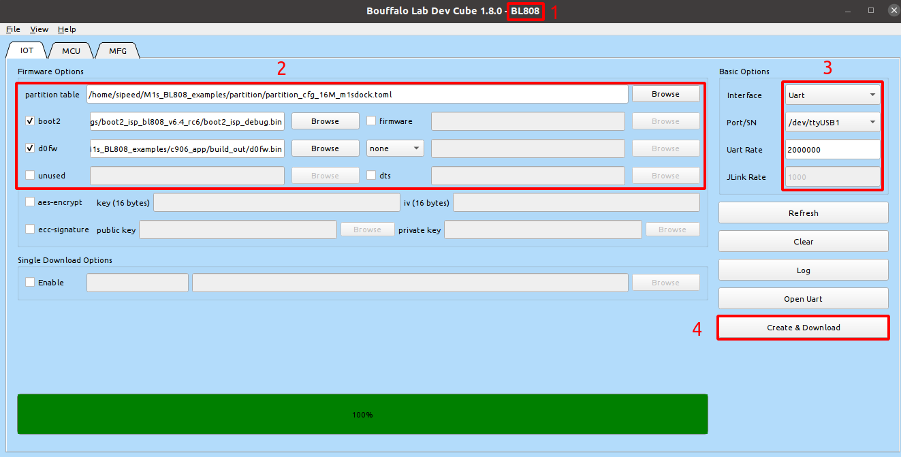
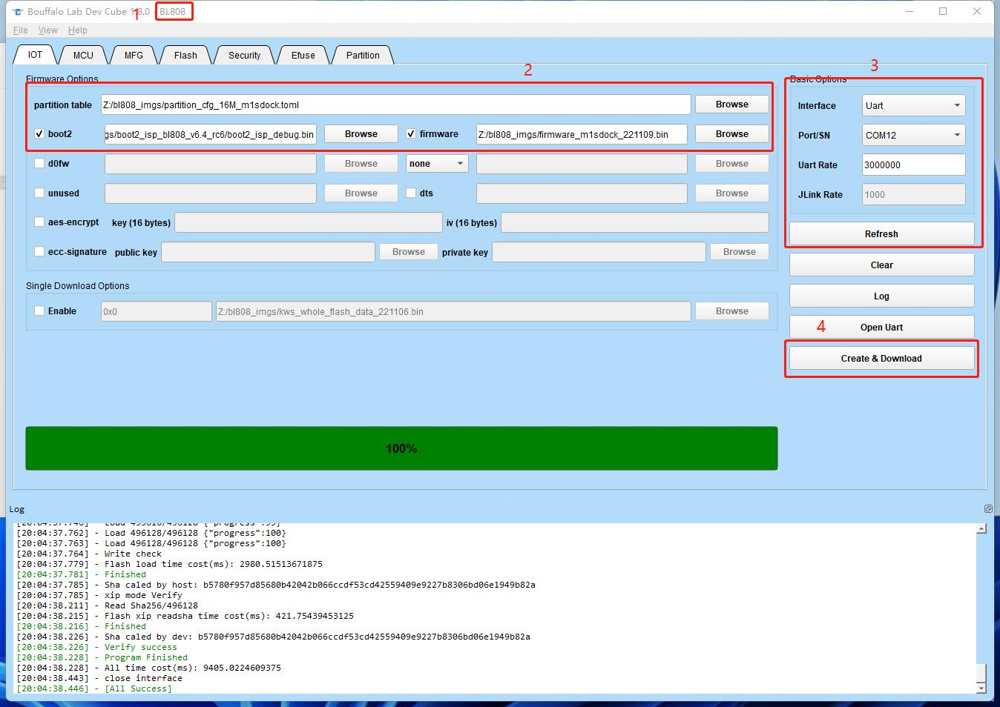

# M1s_BL808_example

## Setup

1. Download sdk

    ```shell
    mkdir ~/bl808 && cd ~/bl808
    git clone https://github.com/sipeed/M1s_BL808_SDK.git
    ```
    
2. Download example

    ```shell
    cd ~/bl808
    git clone https://github.com/sipeed/M1s_BL808_example.git
    cd M1s_BL808_example && ln -s ../M1s_BL808_SDK ./
    ```

3. Download toolchain [here](https://dl.sipeed.com/shareURL/others/toolchain) or [here](https://occ.t-head.cn/community/download?id=4073475960903634944). Extract it to `M1s_BL808_SDK/toolchain/` and rename to  `Linux_x86_64` 

    ```shell
    cd ~/bl808 && mkdir M1s_BL808_SDK/toolchain
    
    mv {your_download_path}/Xuantie-900-gcc-elf-newlib-x86_64-V2.6.0-20220715.tar.gz ~/bl808
    tar -zxvf Xuantie-900-gcc-elf-newlib-x86_64-V2.6.0-20220715.tar.gz -C M1s_BL808_SDK/toolchain/
    
    cd M1s_BL808_SDK/toolchain && mv Xuantie-900-gcc-elf-newlib-x86_64-V2.6.0/ Linux_x86_64 && cd -
    ```

4. Build the hello_world example

    ```shell
    cd ~/bl808/M1s_BL808_example/c906_app/

    # Configure environment variables (Executed only once per working environment)
    export BL_SDK_PATH=../M1s_BL808_SDK

    # Compile the hello_world project
    ./build.sh hello_world
    ```

5. The compilation is complete, and the target file is saved in the `build_out` path

##  Flash Guide

1. Download flash tool and startup

    Go to [bflb_dev_website](https://dev.bouffalolab.com/download) and download `Bouffalo Lab Dev Cube` released on `2022-09-01` and with version `v1.8.0`

    ```shell
    # unzip
    unzip BouffaloLabDevCube-v1.8.0.zip
    
    # startup
    ./BLDevCube-v1.8.0/BLDevCube-ubuntu &> /dev/null &
    ```

2. Download bl808 firmware

    - Use the type-c usb cable to connect from the PC side to the UART port of the board

    - Keep the `BOOT` button pressed and click `RST` button, then release the `BOOT` button

    - Startup `BLDevCube Tools` and choose `BL808` chip

    - Configure the tool according to the label below, finally click `Create & Download` will start to download firmware

        

3. Download bl702 firmware

    - Press the `BOOT` button, and connect the type-c cable to the UART port, then release the `BOOT` button

    - Startup `BLDevCube Tools` and choose `BL702/704/706` chip

    - Configure the tool according to the label below, finally click `Create & Download` will start to download firmware

        

4. Download e907 firmware

    - Use the type-c usb cable to connect from the PC side to the UART port of the board

    - Keep the `BOOT` button pressed and click `RST` button, then release the `BOOT` button

    - Startup `BLDevCube Tools` and choose `BL808` chip

    - Configure the tool according to the label below, finally click `Create & Download` will start to download firmware

        

5. About partition table files

    The partition table of bl808 is written in toml file format. You can specify the flash size used by the firmware by modifying the partition table.

    The default partition table is provided in the M1s_BL808_example/partition directory, and you can also create your own partition table.
